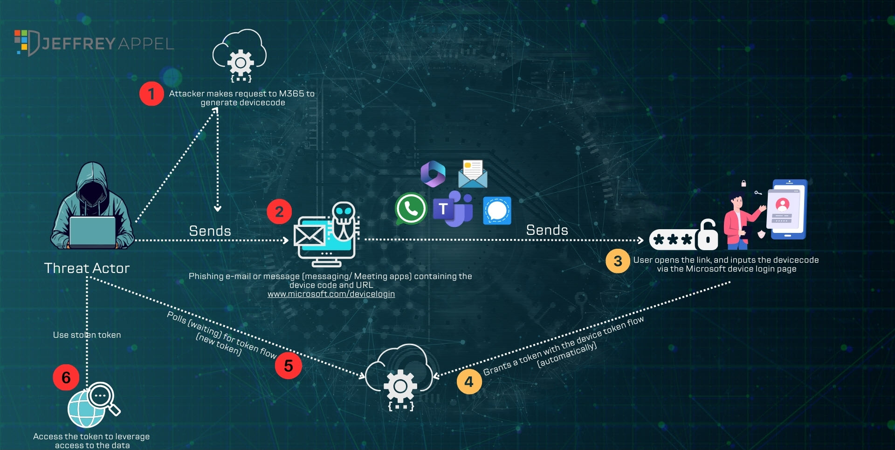
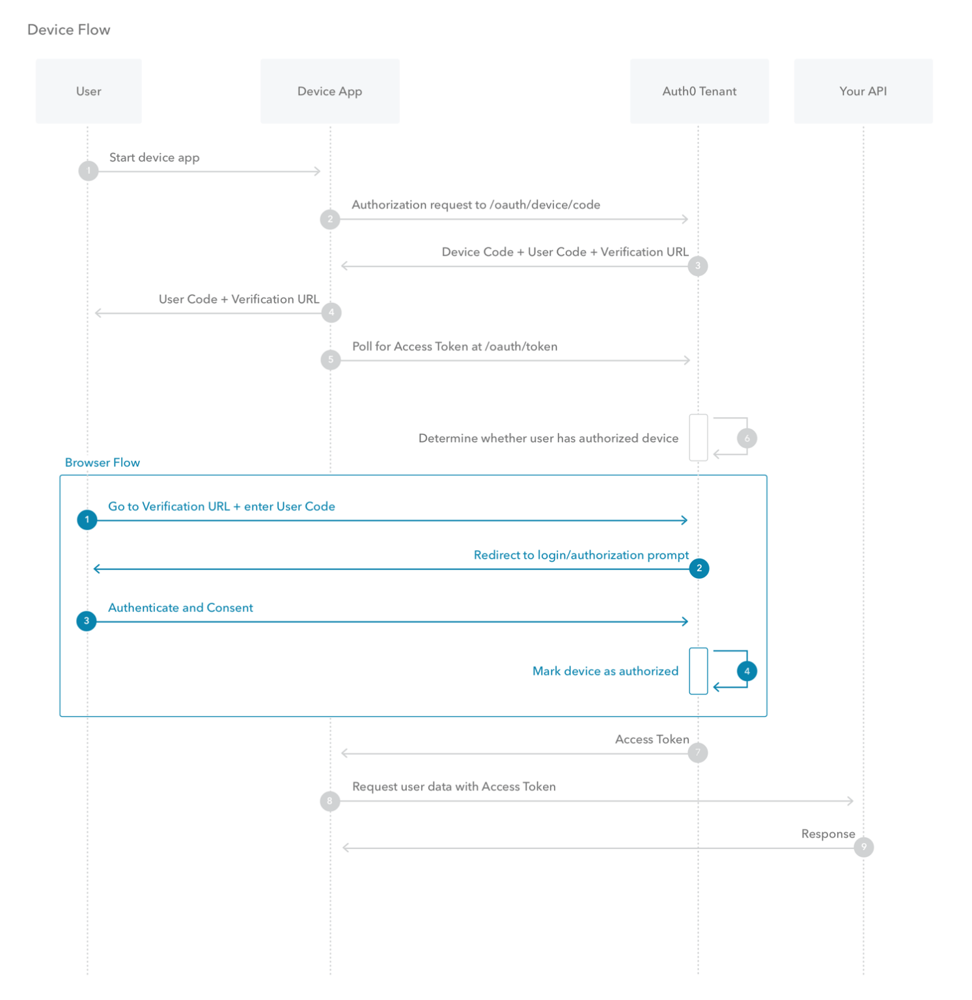
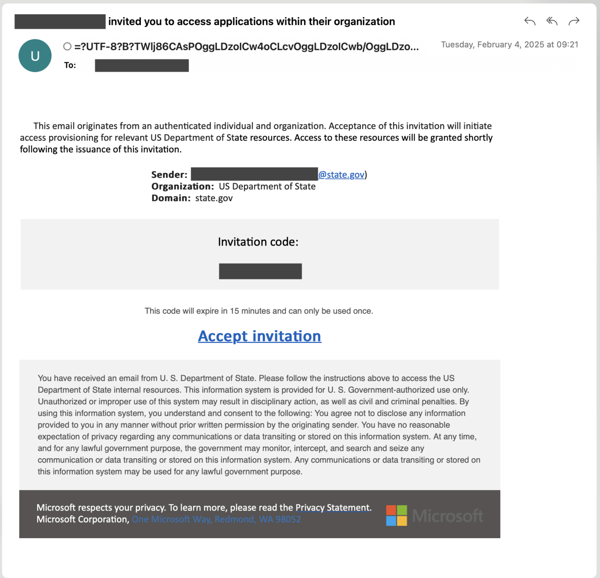
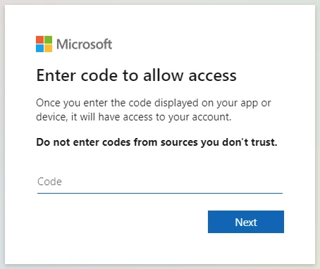

---
tags:
  - Azure
  - Security
date: 2025-02-19
---
# [[Device Code Flow abuse]]



Since August 2024 there has been a sophisticated phishing campaign actively leveraging the device code authorization flow. Currently, there is a wide range of attacks targeting a wide range of sectors including government/ IT services and critical industries. The attack is known as _[Storm-2372](https://www.microsoft.com/en-us/security/blog/2025/02/13/storm-2372-conducts-device-code-phishing-campaign/)_ and is linked to Russian state interests.

Device code authentication is useful when you don't have a browser available, like on a headless server or in some automation scenarios and other devices without a proper keyboard or input mechanism.
In the Microsoft Graph PowerShell SDK, the -UseDeviceCode parameter is used to initiate the device code flow.


## A typical attack flow:

**Initial Contact**: The attackers contact the end-user via third-party messaging platforms such as WhatsApp/ Signal or even Microsoft Teams. Mostly they share context related to fake meeting invitations/ calendar invitations with a code (device code)



**Phishing Execution**: Via the chat messages victims are directed to enter a code on the Microsoft login page, one authenticated and the device code flow is not prevented – the attackers are getting full access.


**Post-Compromise Activities**: The attackers are now using the tokens to access sensitive data via the API/ harvest credentials or lateral movement within the environment from the compromised accounts.


---
## Mitigation and protection guidance

To harden networks against this activity, defenders can implement the following:

- Only allow device code flow where necessary. Microsoft recommends [blocking device code flow wherever possible](https://learn.microsoft.com/entra/identity/conditional-access/policy-block-authentication-flows). Where necessary, configure Microsoft Entra ID’s [device code flow](https://learn.microsoft.com/entra/identity/conditional-access/concept-authentication-flows) in your Conditional Access policies.
- Educate users about common phishing techniques. Sign-in prompts should clearly identify the application being authenticated to.
- Consider setting a Conditional Access Policy to force re-authentication for users.
- [Implement a sign-in risk policy](https://learn.microsoft.com/azure/active-directory/identity-protection/howto-identity-protection-configure-risk-policies) to automate response to risky sign-ins. A sign-in risk represents the probability that a given authentication request isn’t authorized by the identity owner. A sign-in risk-based policy can be implemented by adding a sign-in risk condition to Conditional Access policies that evaluates the risk level of a specific user or group. Based on the risk level (high/medium/low), a policy can be configured to block access or force multi-factor authentication.

---
## Hunting queries

The following query can help identify possible device code phishing attempts:
```kql
let suspiciousUserClicks = materialize(UrlClickEvents
    | where ActionType in ("ClickAllowed", "UrlScanInProgress", "UrlErrorPage") or IsClickedThrough != "0"
    | where UrlChain has_any ("microsoft.com/devicelogin", "login.microsoftonline.com/common/oauth2/deviceauth")
    | extend AccountUpn = tolower(AccountUpn)
    | project ClickTime = Timestamp, ActionType, UrlChain, NetworkMessageId, Url, AccountUpn);
//Check for Risky Sign-In in the short time window
let interestedUsersUpn = suspiciousUserClicks
    | where isnotempty(AccountUpn)
    | distinct AccountUpn;
let suspiciousSignIns = materialize(AADSignInEventsBeta
    | where ErrorCode == 0
    | where AccountUpn in~ (interestedUsersUpn)
    | where RiskLevelDuringSignIn in (10, 50, 100)
    | extend AccountUpn = tolower(AccountUpn)
    | join kind=inner suspiciousUserClicks on AccountUpn
    | where (Timestamp - ClickTime) between (-2min .. 7min)
    | project Timestamp, ReportId, ClickTime, AccountUpn, RiskLevelDuringSignIn, SessionId, IPAddress, Url
);
//Validate errorCode 50199 followed by success in 5 minute time interval for the interested user, which suggests a pause to input the code from the phishing email
let interestedSessionUsers = suspiciousSignIns
    | where isnotempty(AccountUpn)
    | distinct AccountUpn;
let shortIntervalSignInAttemptUsers = materialize(AADSignInEventsBeta
    | where AccountUpn in~ (interestedSessionUsers)
    | where ErrorCode in (0, 50199)
    | summarize ErrorCodes = make_set(ErrorCode) by AccountUpn, CorrelationId, SessionId
    | where ErrorCodes has_all (0, 50199)
    | distinct AccountUpn);
suspiciousSignIns
| where AccountUpn in (shortIntervalSignInAttemptUsers)
```


This following query from public research surfaces newly registered devices, and can be a useful in conjunction with anomalous or suspicious user or token activity:

```kql
CloudAppEvents
| where AccountDisplayName == "Device Registration Service"
| extend ApplicationId_ = tostring(ActivityObjects[0].ApplicationId)
| extend ServiceName_ = tostring(ActivityObjects[0].Name)
| extend DeviceName = tostring(parse_json(tostring(RawEventData.ModifiedProperties))[1].NewValue)
| extend DeviceId = tostring(parse_json(tostring(parse_json(tostring(RawEventData.ModifiedProperties))[6].NewValue))[0])
| extend DeviceObjectId_ = tostring(parse_json(tostring(RawEventData.ModifiedProperties))[0].NewValue)
| extend UserPrincipalName = tostring(RawEventData.ObjectId)
| project TimeGenerated, ServiceName_, DeviceName, DeviceId, DeviceObjectId_, UserPrincipalName
```
